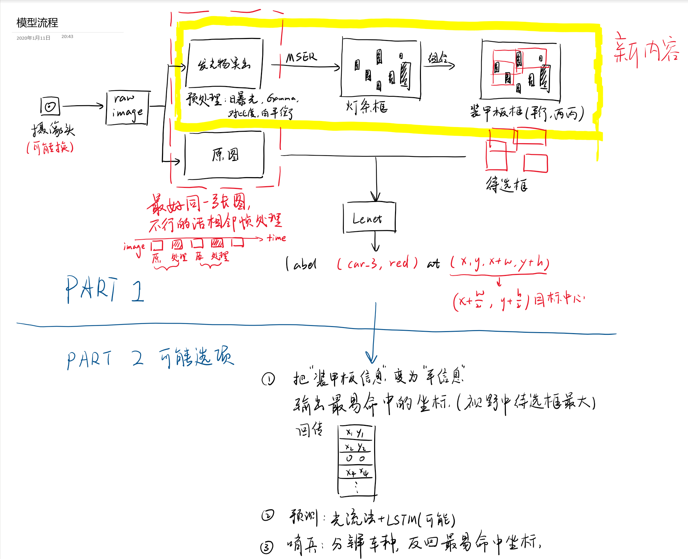

# 基于mxnet的数字识别模型

## ATTENTION:
 - 官方四个文件夹都已经初步处理完了，从得到的结果（装甲板的分类中有大量只有灯条的图片）可以推测出，官方的逻辑是
   1. 先识别灯条
   2. 根据灯条定位
   3. 识别灯条边上有没有数字
 - 所以我们可以学着用这个来做
 - 通过改变摄像头的曝光，白平衡，gamma等等让`发光`的灯条更加明显
 - @ricky!!!，@章鱼哥

## ISSUE:
- 要重新清洗数据集
   - [ ] 官方的装甲板box把两边的灯条放进去了，自己的应该没有，要割掉这一部分
   - [ ] 官方的图有从上往下拍的，装甲板的数字有旋转超过90度的
   - [ ] 官方识别的装甲板有一些全是长灯条，让人头疼
   - [ ] `DJI ROCO\robomaster_Central China Regional Competition\image_annotation\AllianceVsArtisans_BO2_2_0.xml这个annotation`找不到原图文件

## 2020.1.14
更新了`data_clearing_light_bar.py`

搞了一个清洗装甲板图片的程序，程序里面写的挺烂的，图形界面操作真的烦，但这样就可以大家一起 ~~当搬砖工~~ 清洗数据啦

目前决定先用一定条件，把大部分可能的选出来，然后人工找那些程序不太好判断的

## 2020.1.11
上次开会讨论得出的模型示意图，和后续可能的发展方向

## 2020.1.4
官方四个文件夹都已经初步处理完了

## 2020.1.4
官方数据集的预处理计划启动：
1. 把官方的annotation中装甲板信息提取出来，做成自己的json
2. 把官方的原图中的装甲板部分分割出来（可能做数字部分的切割）
3. 把这两部分信息整合成自己的训练集，初步训练模型之后在根据自己的数据集训练
   
   把部分预处理图片上传到example中
   
   官方第一个文件夹处理完成

## 2019.12.26
基于mxnet框架，用了lenet的结构搭的模型。还没处理训练集，没训练
