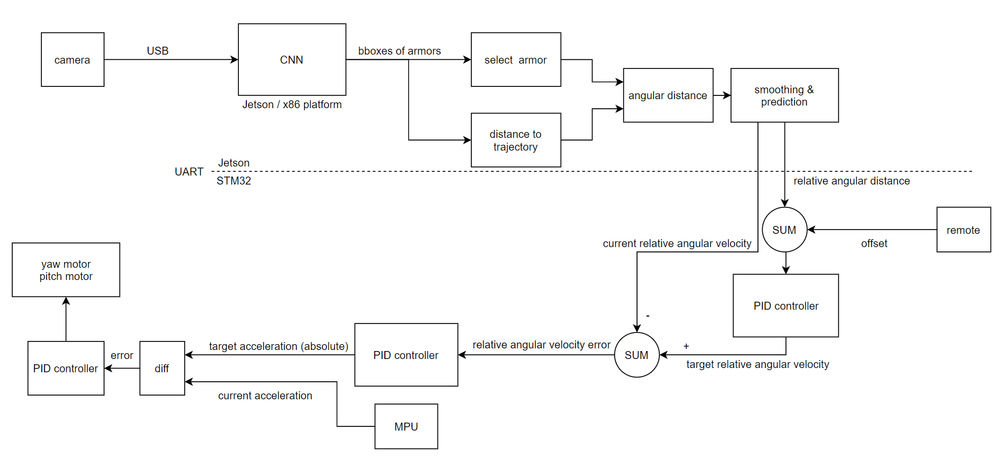
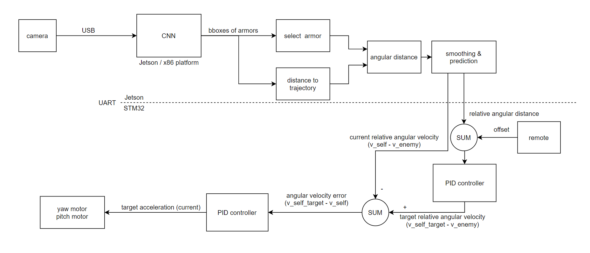
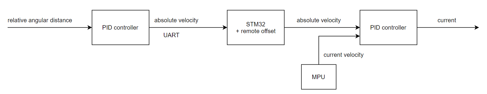
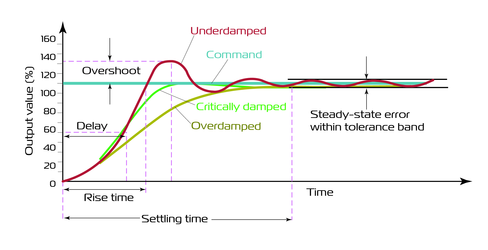

### Meta Auto-Shooting System Guidance

Meta 步兵机器人自瞄基本系统设计。目前全部用的 python，可跨平台运行，调参建议用 Windows (英伟达显卡) 更加方便。

### Block Diagram 1

理想模型，还没做出来。



#### Camera

目前用的 640x480@120FPS, 改进方向：双目景深摄像头，但感觉没必要。

#### CNN

目前用的 MxNet 框架，YOLOv3-tiny 模型， 大疆官方数据集，只检测红蓝装甲板，王晶华同学在学校服务器集群上训练的，精度还可以。Jetson Nano 15 fps。

改进方向： 
- 上 EGX Jetson Xavier NX；
- 模型输入层可以缩小，目前是 416x416;
- 上完整 YOLOv3 提高精度；
- 同时识别机器人；
- Pruning 剪掉一部分参数
- Quantization 量化到 INT8, 降低带宽和计算量。但 Jetson Nano 没有 INT8 计算单元，没用。 Jetson Xavier NX 可能有用。
- 自定义网络结构，网络结构搜索。

### 弹道

一定射速下弹道在相机图片上是一条固定曲线，目标距离与点对应。通过装甲板图像高度得到实际距离，再根据距离选出图片中的射击位置，用于计算像素偏移。

高级做法：
1. 对子弹建模，算出一定射速下的弹道；
2. 对相机建模，有一个 3x3 intrinsic matrix; 相机与外界坐标系有一个 3x4 extrinsic matrix; 算出弹道在图片中的映射。
3. 根据距离找到射击点

### 相对距离（角度）

根据像素位置差和相机视角什么的算出相对角度距离

### 输出滤波

如果 CNN 输出方差大可以用一下。目前用的 二阶回归， 推荐 扩展卡尔曼滤波。

### 预测

影响 PID 收敛，没啥用。

### offset

通过遥控器加一个位置 offset 微调 落弹点。

### 当前相对角速度预测

从 CNN 历史数据预测， 用于 PID 输入

### UART 发送给 STM32

19200 波特率 8位数据位 1位停止位 无校验 

格式：

```
yaw0, yaw1, pitch0, pitch1, end=0xFE

共5个byte, 前四个数据取值0~100，100进制
接收方法：用一个5位shift buffer, 如果收到 0xFE, 把前四个解码；否则移一位。
decode: (yaw0*100+yaw1-5000)/10000*90 缩放到 -90 ~ 90

注：目前只能发送一组 yaw, pitch 数据，要发送两组请拓展到 9位。
```

### PID1

PID 控制器用于控制二阶系统，即一次积分关系，高阶系统需要多个PID叠加。

输入： 当前相对距离
输出： 目的相对速度

### PID2

输入： 目的相对速度 - 当前相对速度
输出： 目的加速度

### PID3

输入： 目的加速度 - 当前加速度
输出： 电机电流

这层 PID 作用： 维持速度，如果输入error为0，将始终保持当前速度。


### Block Diagram 2




砍掉了最后一层pid, 完全不用 MPU. 看起来可以但实际上由于重力存在加速度与电流不成正比，试了一下不可行。

### Block Diagram 3



目前采用方法，假设目标速度为零，不检测目标速度。简单稳定，静态目标命中率很高，动态目标 PID理论error 不是零, 一定有偏差。高速目标命中率为0。

### Conclusion

1. 云台质量太大，阻尼太大，响应慢延迟大，需要PID调参并增大输出功率



2. CNN　输入没有预处理，弱光下准确率很低，需要进行一定的预处理。
3. 第一种控制方案对系统要求比较高，实现困难，目前还未完成。
